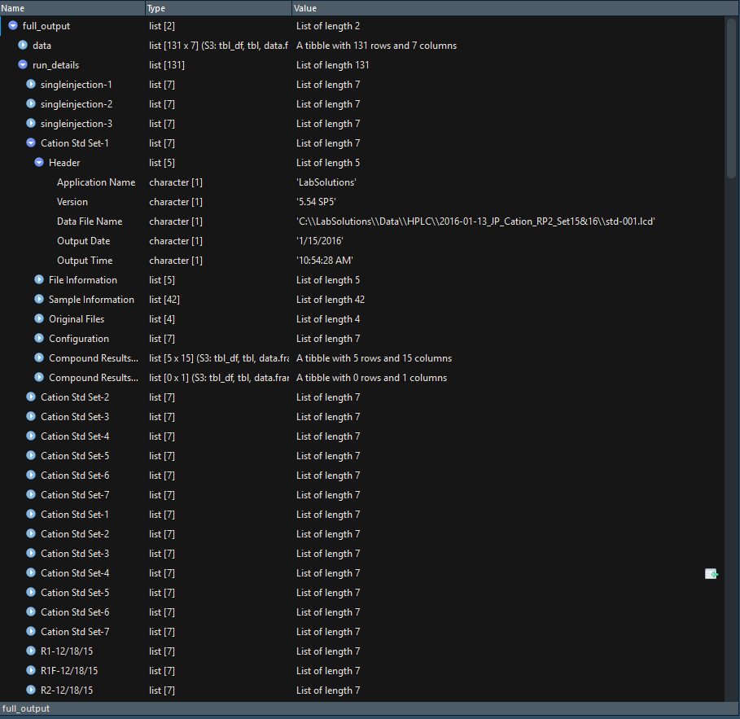

This README shows a basic usage of `parse_hplc` function provided in the `R/parse-hplc.R` file in this repository. This function allows users to pass a file path to an output file to the function and it will retrieve the sample data from the .txt file. 

Here I will show a bried example of how it is done. 


First, I will `source` the required script. **NOTE:** This *may* move to a package later depending on want/need from people in the Lab for easier access/use

```{r}
source("parse-hplc.R")
```

This script will take care of installing any required packages that you do not already have installed on your system. It will also load the `parse_hplc` function into your global environment. Now we can simply call the function by giving it a path to an text file that was output from the LabSolutions HPLC. Here, the `ExampleInput.txt` will be used. 

If we do not specify an output path, than by default a tibble will be returned that can be used for further analysis. 

```{r}
parse_hplc("ExampleInput.txt")
```


By default, only the data is returned from this function with one row representing one sample with all of the analyses given as columns. If you are returning the info to your R session (i.e. leaving `path = NULL` as it is by default) than you can also get the rest of the information for each sample returned by setting `output_type = "full"`. 

```{r, include=FALSE}
parse_hplc("ExampleInput.txt", output_type = "full")

```

The raw output of this function can be a bit unwiedly, and it likely won't save well to any standard output type, other than maybe json, but you can explore it via R and RStudio's View pane. Here is a screen shot of the output of this function:




Finally, If you would like to simply save the file to a csv for use in excel, than you can just provide a path to the desired output.

```{r, include=FALSE}
parse_hplc("ExampleInput.txt", path = "example-output.csv")

```